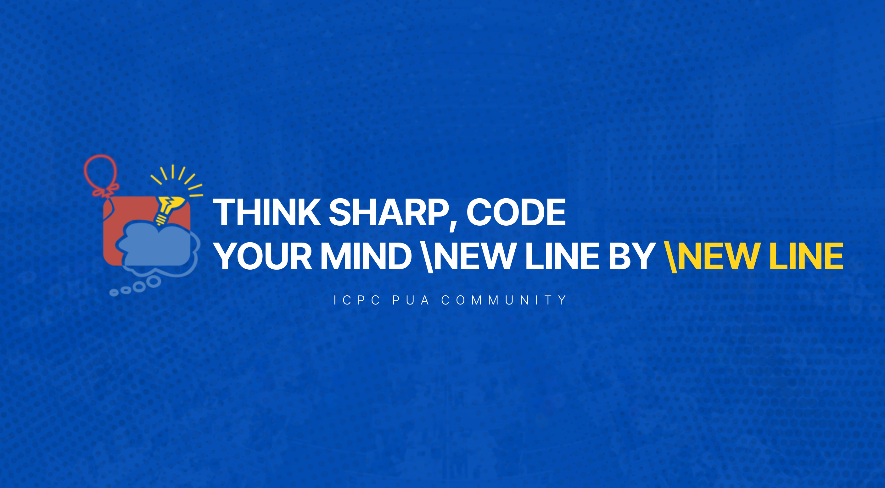

# ICPC PUA Training Program For 2025 Season! 🏆

## 📚 Training Sheets
- [ICPC Assiut](https://codeforces.com/group/MWSDmqGsZm/contests)
- [NeetCode](https://neetcode.io/roadmap)
- [Enhanced Interview Sheet - DR. Mustafa Saad](https://docs.google.com/spreadsheets/d/10cdF-FZrZiug3M9JIQ6neH7pris8f4lkpdzJSPAU8dE/edit?gid=0#gid=0)
  This sheet will take you from Zero to intermediate level (Rate 1800 on CF)! 🚀
- [CP Sheet - DR. Mustafa Saad](https://docs.google.com/spreadsheets/d/1iJZWP2nS_OB3kCTjq8L6TrJJ4o-5lhxDOyTaocSYc-k/edit?gid=855203541#gid=855203541) this sheet has 7 levels: A — B — C1 — C2 — D1 — D2 — D3.
  Ignore the first 3 levels if you passed the "Enhanced Interview Sheet" and start from C2. 

### Resources Used
[Post With ALL the resources](https://codeforces.com/group/OnqQS48TMT/blog/entry/14521)

## 📚 Level 1: Foundations
> A comprehensive introduction to competitive programming fundamentals. This level covers C++ basics, data structures, algorithms, and essential problem-solving techniques. Perfect for beginners looking to build a strong foundation.

### 🔰 Session 1: Getting Started with C++
- [Intro to C++ (Arabic)](https://www.youtube.com/watch?v=E1gCgPIzYxk)
- [More on C++ Basics (Arabic)](https://www.youtube.com/watch?v=r1QccJLFdaE)
- [Conditions & Loops in C++ (Arabic)](https://www.youtube.com/watch?v=j7u4dlGYAWU)

### 📊 Session 2: Data Structures & Complexity Analysis
- [Vector, struct, pair](https://www.youtube.com/watch?v=pvTg_7tm9Ek&list=PLIFVa-hDlNlcRtB5-zdzRrOkCy64dNKW6&index=4&t=0s)
- [Arrays & Strings in C++ (Arabic)](https://www.youtube.com/watch?v=gp_836SEvnk)
- [Overflow and type casting (Arabic)](https://www.youtube.com/watch?v=DsHN4NWNNvY)
- [Complexity of Algorithms I (Arabic)](https://www.youtube.com/watch?v=hYalOGs1_Og)
- [Complexity of Algorithms II (Arabic)](https://www.youtube.com/watch?v=dZiZ0zsMBNQ)

### 🗃️ Session 3: Advanced Data Structures I
- [Frequency array (Arabic)](https://www.youtube.com/watch?v=kQGTjql8WjI)
- [Data structures - Map (Arabic)](https://www.youtube.com/watch?v=6Lf9llfyHjE)
- [Data structures - Set (Arabic)](https://www.youtube.com/watch?v=u9MlGkEwf_4)

### 📦 Session 4: Advanced Data Structures II
- [Data structures - Stack (Arabic)](https://www.youtube.com/watch?v=cBmy4x0G0G8)
- [Data structures - Queue (Arabic)](https://www.youtube.com/watch?v=Z0nYHbhqwgU)

### 🔄 Session 5: Two-Pointers & Sliding Window
- [Two pointers technique (Arabic)](https://www.youtube.com/watch?v=n-Xwrr8RFQ0)

### 🔍 Session 6: Binary Search
- [Binary Search (Arabic)](https://www.youtube.com/watch?v=qrwupQ2_iJo&t=900s)

### 🔢 Session 7: Number Theory
- [Modular Arithmetic](https://www.youtube.com/live/9sqvjnvuLtY)
- [Number Theory - Primes (Arabic)](https://www.youtube.com/watch?v=VZBfW08ECgA)
- [Factorization](https://youtu.be/-5ApOQDhBtU)
- [Number Theory - Fib, GCD, LCM, Pow (Arabic)](https://www.youtube.com/watch?v=YklnFXpq0ZE)

### 🎲 Session 8: Combinatorics
- [Counting Principles (Arabic)](https://www.youtube.com/watch?v=sr6WgCLcgVM)
- [Permutations and Combinations - 1 (Arabic)](https://www.youtube.com/watch?v=9wvqNeX_JnI)
- [Permutations and Combinations - 2 (Arabic)](https://www.youtube.com/watch?v=8V_xhaPpjmM)

### 🔁 Session 9: Recursion & Backtracking
- [Recursion](https://youtu.be/hyk46UmJPS4)
- [Backtracking](https://youtu.be/hLXVhRzqq18)

### 🔧 Session 10: Bit Manipulation
- [Bitwise Operations (Arabic)](https://www.youtube.com/watch?v=sK0uVbs_J6Y)
- [C++ Programming 4 Competitions - Bits (Arabic)](https://www.youtube.com/watch?v=ldwGf-iVsdU)
- [Bitset (Arabic)](https://www.youtube.com/watch?v=mTtlfH9AqNU)

## 📈 Level 2: Advanced Graph Theory
> Deep dive into graph algorithms and dynamic programming. This level focuses on advanced problem-solving techniques using graphs, essential for competitive programming competitions.

### Resources Used
#### Videos
- [Dr Mustafa Saad: Graph Theory](https://www.youtube.com/playlist?list=PLPt2dINI2MIb4OXlJ_EEwIDV9WVUpRQ5K)

#### Problems
- [Al-Azhar Graph sheet](https://docs.google.com/spreadsheets/d/1ktBBshUFulQWt9mP6MEtJtNjROjFgvxQSHDzo0a3D7U/edit?gid=0#gid=0)
- [Neetcode 150](https://neetcode.io/roadmap)

### 🕸️ Session 11: Graph Basics
- [Graph Representation (Arabic)](https://www.youtube.com/watch?v=pOLUrNoEAzk)
- [BFS (Arabic)](https://www.youtube.com/watch?v=PbcIjZ1Pm9w)

### 🌳 Session 12: Depth-First Search
- [DFS (Arabic)](https://www.youtube.com/watch?v=LvyXRQeEue0)

### 📊 Session 13: Dynamic Programming
- [Topic Stream Mashup: Dynamic Programming](https://codeforces.com/gym/302977)
- [Dynamic Programming I (Arabic)](https://www.youtube.com/watch?v=TNgPT91sn90)

### 🛣️ Session 14: Advanced Graph Algorithms
- [Floyd Algorithm (Arabic)](https://youtu.be/ZIJLCVn4KzQ)
- [Dijkstra (Arabic)](https://youtu.be/Deh1X1FFTxA)
- [Bellman-Ford - Part 1 (Arabic)](https://youtu.be/g4CWwTOGxdM)
- [Bellman-Ford - Part 2 (Arabic)](https://www.youtube.com/live/6ZkzwwpIYcY)

By the end of this training program, you will have built a strong foundation in competitive programming, mastered key problem-solving techniques, and developed the ability to tackle challenging algorithmic problems efficiently! 💥

